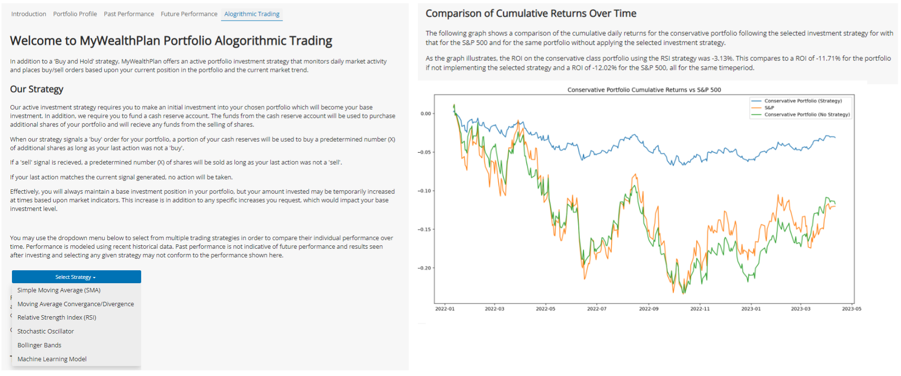

# MyWealthPath Algorithmic Trading and ML Tool

This Project is a Dashboard application that expands upon the [Portfolio Selection and Simulation Tool](https://github.com/LourdesDB/personal_financial_advisor) already created in Project 1, MyWealthPath.

In that **initial project**, a Portfolio Selection Tool was created as a dashboard application designed to determine a user's risk tolerance for investments (online questionnaire). Based upon that tolerance, they are presented with information on one of 5 preselected portfolios who's asset weightings align with the user's risk tolerance. After being matched to a portfolio, the user can navigate between 3 informational tabs to find details related to their portfolio, including asset category weights, historical performance and potential future performance (Montecarlo simulation).

In this **second phase** of the project, the user has access to a new tool that allows them to:

* Choose amoung different Trading Strategies that enhance the Portfolio performance beyond the base 'buy and hold' strategy
* Backtest the performance of the strategy of choice and benchmark it against a Market reference.
* Run the Monte Carlo simulation for expected future returns
* Get a more customized prediction based on a ML model selected by the tool among many as the most accurate and best performing one

For this second Project, a full description of the analysis process and coding has been created in the [Data](https://github.com/tlchampion/mwp_algorithmic_trading/blob/main/data/README.md) and [Modeling](https://github.com/tlchampion/mwp_algorithmic_trading/blob/main/modeling/README.md) specific README files.

And a more detailed presentation can be found [Here](./MyWealthPath_Project_2.pptx).  
=======


---

## Technologies

The MyWealthPlan Investment Platform is written in Python and uses the [Panel](https://panel.holoviz.org/index.html) dashboarding solution to present information to the user. 

Visualizations are provided by the [Bokeh](https://bokeh.org), [hvPlot](https://hvplot.holoviz.org) and [Matplotlib](https://matplotlib.org) libraries. 

Details on asset performance are retrieved using the [Yahoo Finance](https://finance.yahoo.com) API.

Performance indicators are calculated using the [Pandas TA](https://twopirllc.github.io/pandas-ta/#dataframe-methods) library.

The [Pandas](https://pandas.pydata.org) and [Numpy](https://numpy.org) libraries are used to work with the asset data retrieved from the API.

For the Machine Learning Models training, testing and selection, the [scikit-learn](https://scikit-learn.org/stable/index.html) and [TensorFlow](https://www.tensorflow.org) libraries are used.

Hyperparameter tuning of the TensorFlow models was accomplished using [KerasTuner](https://keras.io/keras_tuner/).


---

## Installation Guide

The contents of the repository should be placed into the desired folder on the users computer, being sure to maintain the directory structure. 

The following python packages must be installed to run the application locally:
* pandas
* panel
* bokeh
* matplotlib
* yahoo_fin
* numpy
* hvplot
* tensorflow
* keras-tuner
* pandas_ta
* jupyterlab (only if the .ipynb file is used. running the .py file does not require jupyterlab)

These packages may be individually installed into the environment of your choice or you may create a new conda environment using the included environment.yml file. 

```
conda env create -f environment.yml
```

If you prefer using pip, the included requirements.txt file may be used to install the required packages.

```
pip install -r requirements.txt
```
### Data Refresh

Rather than continually make API calls and perform calcuations when data only updates on an at most daily basis, the application relies on preprepared data and images. As such, it is recommended to refresh these data sets and images on a periodic basis,such as weekly or monthly, in order to present more current and relevant information.

You may refresh the data at anytime by running the script provided in the scripts directory:

```
python create_data_files.py
```

Do the the volume of data and images being prepared, this process can take some time so please be patient when choosing to refresh.

---

## Launching

The MyWealthPath Investment Platform can be run from the jupyter notebook or by using the included python script. In either case, once launched a [Panel](https://panel.holoviz.org/index.html) dashboard will be displayed.

To run the included python script (```mywealthpath.py``` issue the following command after switching to the correct python environment:

```
panel serve mywealthpath.py
```
This will initiate a local server. Please review the output for the server address, which may then be accessed using the browser of your choice.


To run the jupyter notebook (```mywealthpath.ipynb```) begin by launching jupyter lab in the correct python environment:

```
jupyter lab
```

After Jupyter Lab is running, open the ```mywealthpath.ipynb``` file from the sidebar and then use Run > Run All Cells from the menu.


---

## Usage


The left-hand portion of the dashboard consists of a six-question risk tolerance questionnaire. Once the questions are answered and the submit button is clicked the a risk tolerance score will be calculated for the user and they will be assigned a risk tolerance category. 


Once determined, the risk tolerance category is used to assign the user to one of five predetermined portfolios that vary in their overall level of investment risk. Details on the assigned portfolio are provided in the tabs found in the upper-right-hand portion of the dashboard. The following information will presented to the user:


Then the client can go to the 'Past Performance' tab where a deeper analysis of past performance and Benchmark vs Market are provided for their chosen portfolio:


On the next tab, a 10 years Monte Carlo Simulation can be launched in order to get a lower and upper range for the expected performance with a 95% confidence interval:


Lastly, on the **'Algortihmic Trading' tab**, the user can select a Trading Strategy and a backtest of it's performance will be displayed (vs the plain 'buy and hold' Portfolio and vs the S&P500 as Market reference). The tool will also choose the best performing ML Model among 7 different models (and 11 parameter variations within each of them).



It will also show Monte Carlo simulations for the strategy:


With all this information, the Client can clearly see both the past and predicted performance of the base Portfolio (buy and hold) assigned to their risk-aversion level, its performance if they add an 'enhancing' trading strategy, and the benchmark/comparison against a widely used Market reference.


---

## Contributors

[Ahmad Takatkah](https://github.com/vcpreneur)<sup>1</sup>     
[Lourdes Dominguez Bengoa](https://github.com/LourdesDB)  
[Patricio Gomez](https://github.com/patogogo)  
[Lovedeep Singh](https://github.com/LovedeepSingh89)  
[Thomas L. Champion](https://github.com/tlchampion)  

---

## License

License information can be found in the included LICENSE file.

---
## Credits
* Risk Analysis Survey was compiled based upon a survey provided by [Lincoln Financial Group](https://bit.ly/3InwBMP)
* Code for generating the Monte Carlo Simulation was modified from code provided by UC Berkeley Extension FinTech Bootcamp

___
## Future Work

Future work and/or enhancements to this project include:
* Implementing a more robust Risk Analysis Survey
* Adding in features to allow a user to fine-tuning their portfolio
* Adding market information for the client
* Improve visualizations
* Enhance UI/UX
* Add a blockchain contracts feature to onboard and sign-up the client


---

## Disclaimer

The information provided through this application is for information and educational purposes only. 
It is not intended to be, nor should it be used as, investment advice. 
Seek a duly licensed professional for investment advice.

---


<font size = "1"> 1 Ahmad contributed to the initial design of the platform, but was unavailable at the the time the algorithmic tab was added </font>