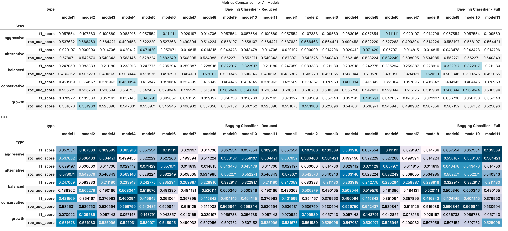
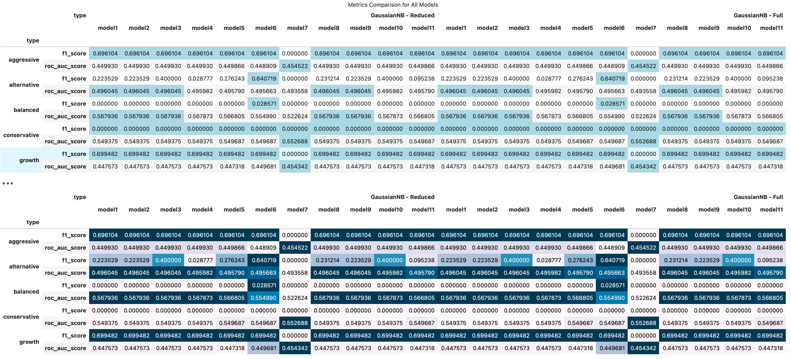
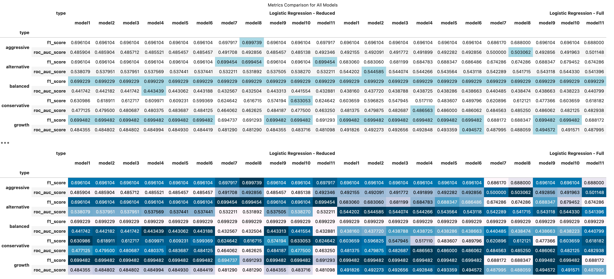
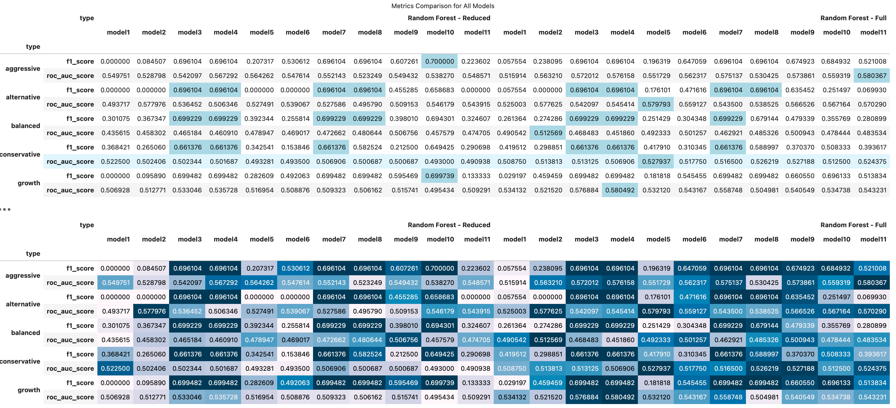
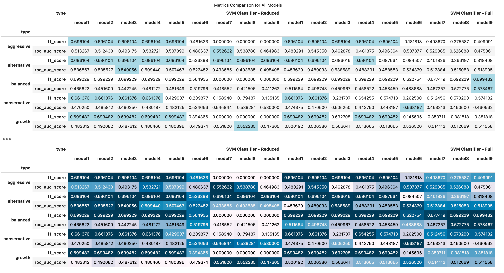
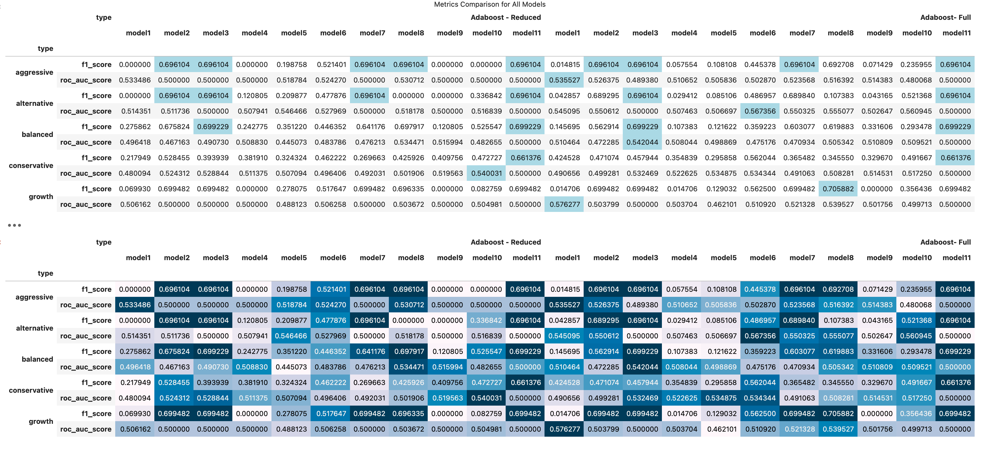
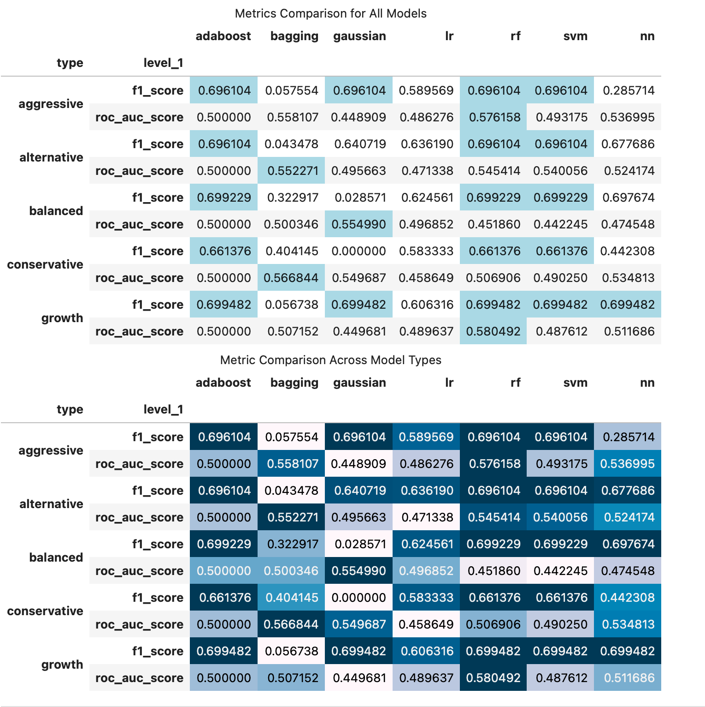

# Modeling

The following process has been followed to test and select the most suitable Models for each Portfolio class:


## 1. Data Loading

Prepared Train/Test datasets were loaded from saved files. Please see the [Data Preparation README](../data/README.md) for details on the preparation of the datasets.


## 2. Model Training

### 2a. Sci-Kit Learn Modeling

An initial set of Machine Learning models were built using six different packages from the Scikit-Learn library:

* Bagging Classifier
* GaussianNB
* Logistic Regression
* Random Forest
* SVM Classifier
* AdaBoost Classifier

As the initial step in the building of all models a ```StandardScaler``` was instantiated. 

Each model class had a minimum of 10-plus models built using different parameters. Please see below for a chart depicting the parameters used for each model:

**Bagging Classifier**

| model   | Base Estimator  | m_estimators | max_samples | max_features | bootstrap | oob_score | random_state |
|:---------:|:-----------------:|:--------------:|:-------------:|:--------------:|:-----------:|:------------:|
| model1  | base_classifier | 200          | 0.8         | 0.5          | True      | True      | 42           |
| model2  | base_classifier | 50           | 0.8         | 0.5          | True      | True      | 42           |
| model3  | base_classifier | 100          | 0.8         | 0.5          | True      | True      | 42           |
| model4  | base_classifier | 100          | 0.9         | 0.5          | True      | True      | 42           |
| model5  | base_classifier | 100          | 0.5         | 0.5          | True      | True      | 42           |
| model6  | base_classifier | 100          | 0.8         | 0.7          | True      | True      | 42           |
| model7  | base_classifier | 100          | 0.8         | 0.3          | True      | True      | 42           |
| model8  | base_classifier | 100          | 0.8         | 0.5          | False     | False     | 42           |
| model9  | base_classifier | 100          | 0.8         | 0.5          | True      | True      | 123          |
| model10 | base_classifier | 100          | 0.8         | 0.5          | True      | False     | 123          |
| model11 | base_classifier | 100          | 0.8         | 0.5          | True      | False     | 42           |


**GaussianNB**                                             

| model   | var_smoothing | priors       |
|:---------:|:---------------:|:--------------:|
| model1  |               | None         |
| model2  | 1e-9          | None         |
| model3  | 1e-5          |  [0.2, 0.8]  |
| model4  | 1e-3          |  [0.5, 0.5]  |
| model5  | 1e-1          | None         |
| model6  | 1.0           |  [.3, 0.7]   |
| model7  | 10.0          |  [0.6, 0.4]  |
| model8  | 1e-9          |  [0.4, 0.6]  |
| model9  | 1e-5          | None         |
| model10 | 1e-3          |  [0.2, 0.8]  |
| model11 | 1e-1          |  [0.5, 0.5]  |


**Logistic Regression**

| model   | random_state | max_iter | solver    | penatly    | l1_ratio |
|:---------:|:--------------:|:----------:|:-----------:|:-------------:|
| model1  | 42           | 10000    | saga      | elasticnet | 0.1      |
| model2  | 42           | 10000    | saga      | elasticnet | 0.3      |
| model3  | 42           | 10000    | saga      | elasticnet | 0.5      |
| model4  | 42           | 10000    | saga      | elasticnet | 0.7      |
| model5  | 42           | 10000    | saga      | elasticnet | 0.9      |
| model6  | 42           | 10000    | saga      | l1         |          |
| model7  | 42           | 10000    | saga      | None       |          |
| model8  | 42           | 10000    | lbfgs     | None       |          |
| model9  | 42           | 10000    | liblinear | l1         |          |
| model10 | 42           | 10000    | liblinear | l2         |          |
| model11 | 42           | 10000    | sag       | None       |          |


**Random Forest**                                                       

| model   | n_estimators | max_depth | min_samples_split | min_samples_leaf | max_features | boostrap | criterion | min_impurity_decrease | class_weight       | oob_score |
|:-------:|:------------:|:---------:|:-----------------:|:----------------:|:------------:|:--------:|:---------:|:---------------------:|:------------------:|:---------:|
| model1  | 100          | 10        | 5                 | 1                | sqrt         | True     | gini      | 0.0                   | None               | False     |
| model2  | 200          | 20        | 10                | 5                | log2         | True     | entropy   | 0.001                 | balanced_subsample | True      |
| model3  | 500          | 30        | 20                | 10               | 0.5          | True     | gini      | 0.005                 | {0: 1, 1: 3}       | True      |
| model4  | 1000         | 40        | 50                | 20               | None         | True     | entropy   | 0.01                  | {0: 1, 1: 5}       | True      |
| model5  | 200          | 20        | 10                | 5                | 0.7          | True     | gini      | 0.0                   | None               | False     |
| model6  | 500          | 30        | 20                | 10               | 0.3          | True     | entropy   | 0.0                   | balanced           | True      |
| model7  | 1000         | 40        | 50                | 20               | sqrt         | True     | gini      | 0.0                   | {0: 1, 1: 10}      | True      |
| model8  | 2000         | 50        | 100               | 50               | log2         | True     | entropy   | 0.0                   | None               | False     |
| model9  | 1000         | 30        | 20                | 10               | None         | True     | gini      | 0.005                 | balanced           | True      |
| model10 | 500          | 20        | 10                | 5                | 0.7          | True     | entropy   | 0.001                 | {0: 1, 1: 5}       | True      |
| model11 | 1000         | 30        | 10                | 5                | 0.5          | True     | entropy   | 0.001                 | balanced           | True      |


**SVM**     

| model  | random_state | kernel  | C   | probability |
|:------:|:------------:|:-------:|:---:|:-----------:|
| model1 | 42           | linear  | 0.5 | True        |
| model2 | 42           | linear  | 1   | True        |
| model3 | 42           | linear  | 10  | True        |
| model4 | 42           | rbf     | 0.5 | True        |
| model5 | 42           | rbf     | 1   | True        |
| model6 | 42           | rbf     | 10  | True        |
| model7 | 42           | sigmoid | 0.5 | True        |
| model8 | 42           | sigmoid | 1   | True        |
| model9 | 42           | sigmoid | 10  | True        |


**AdaBoost Classifier**

| model   | base_estimator                           | n_estimators | learning_rate | algorithm |
|:-------:|:----------------------------------------:|:------------:|:-------------:|:---------:|
| model1  | DecisionTreeClassifier(max_depth=1)      | 100          | 1.0           | SAMME     |
| model2  | LogisticRegression(solver='lbfgs'        | 50           | 0.5           | SAMME     |
| model3  | SVC(kernel='linear'                      | 200          | 0.1           | SAMME     |
| model4  | RandomForestClassifier(n_estimators=50)  | 100          | 1.0           | SAMME     |
| model5  | GradientBoostingClassifier(max_depth=3)  | 150          | 0.2           | SAMME     |
| model6  | DecisionTreeClassifier(max_depth=5)      | 100          | 1.0           | SAMME     |
| model7  | LogisticRegression(solver='lbfgs')       | 50           | 0.25          | SAMME     |
| model8  | DecisionTreeClassifier(max_depth=3)      | 200          | 0.01          | SAMME     |
| model9  | RandomForestClassifier(n_estimators=50)  | 100          | 0.5           | SAMME     |
| model10 | GradientBoostingClassifier(max_depth=10) | 150          | 0.1           | SAMME     |
| model11 | LinearSVC(max_iter=10000)                | 150          | 0.05          | SAMME     |


For each ML algorithm a loop structure was used to build/evaluate each of the 10-plus models using the following steps. The loop was repeated twice, once for the full feature datasets and once for the reduced features datasets:

* A pipeline was instantiated using ```SciKit-Learn Pipeline``` consisting of the ```StandardScaler``` and the model
* The ```X_train``` data was fit to the pipeline
* The pipeline was used to predict the ```X_test``` data
* F1-score and AUC-ROC score were calculated to determine the predictive power of the model
* The evalution metric scores for all configurations of the model were combined into one dataframe


### 2b. TensorFlow Modeling

 A Deep Neural Network consisting of two Dense layers was designed with the intent of predicting portfolio performance. The following steps were involved in the training of the neural network. The steps were repeated twice, once for the full features dataset and once for the reduced features dataset:

A loop was used to perform the following steps once per portfolio:

* StandardScaler() defined and fit to training data
* Training data transformed by scaler
* Test data transformed by scaler
* Keras-Tuner Hypberband tuner was used to find the optimal combination of the following parameters:
    * Number of nodes for Dense layer 1
    * Number of nodes for Dense layer 2
    * Activation function for hidden layer 1
    * Activation function for hidden layer 2
    * learning rate for the optimizer

    The overall model parameters were:

    |                   | parameter                           |
    |-------------------|-------------------------------------|
    | Layer1 Units      | determined by hyperparameter tuning |
    | Layer2 Units      | determined by hyperparameter tuning |
    | Layer1 Activation | determined by hyperparameter tuning |
    | Layer2 Activation | determined by hyperparameter tuning |
    | Optimizer         | Adam                                |
    | Learning Rate     | determined by hyperparameter tuning |
    | loss function     | Binary Crossentropy                 |
    | metrics           | Accuracy                            |
    | epochs            | 100                                 |

    An early stopping callback was used to stop trainig based upon the val_loss function not changing in 5 epochs
    The Hyperband tuner itself was defined with max_epochs of 100

* The optimal set of parameters for each portfolio were saved to a dictionary
* Use optimal parameters to train one model per portfolio using train dataset
* Make predictions using test dataset
* Calculate F1 Score and AUC-ROC score
* Combine models evaluation score into table with those from other models for final review


* F1-score and AUC-ROC score were calculated to determine the predictive power of the model
* The evalution metric scores for all configurations of the model were combined into one dataframe
* The model with the 'best' performance from all the model configurations was chosen
* Once the model with the optimal performance was selected for each model, that metrics for that model were saved to a ```csv file```.
* All csv files for metrics were then loaded and combined into one dataframe for review. **The optimal model for each individual portfolio class was then selected.**
* For each portfolio class, the optimal model was refit and saved for use in creating performance datasets for dashboard usage.


## 3. Model Performance/Selection

Models were evaluated using an ROC-AUC score and F1 score, with the F1 score being the primary metric.

There was a two-tiered decision process to find the best model per portfolio.

The first tier involved the Sci-Kit Learn models only, with the intent to determine which of the set of paramters had the best performance. The hyperparameter tuning the TensorFlow model underwent served this same purpose. The evaluation metrics for each model type were compiled into one comprehensive table for review. The model choses as the best overall model then had it's metrics saved to a csv file for use in the second tier.

The first tier metrics for each model type are shown below:

### Bagging Classifier


### GaussianNB


### Logistic Regression



### Random Forest


### SVM


### Adaboost


Once the best set of parameters were determined, the metrics for all models were compiled into one table for review to select the best model type per portfolio. The metrics for this second tier selection process were:




The final selection of models per portfolio was:

| Portfolio                                              | Model Type    | Paramters                                                                                                                                                                                                                              | Dataset          |
|--------------------------------------------------------|---------------|----------------------------------------------------------------------------------------------------------------------------------------------------------------------------------------------------------------------------------------|------------------|
| Aggressive<br> Alternative<br> Conservative<br> Growth | Random Forest | n_estimators=1000<br> max_depth=40<br>  min_samples_split=50<br> min_samples_leaf=20<br> max_features=None<br> bootstrap=True<br> criterion='entropy'<br> min_impurity_decrease=0.01<br>  class_weight={0: 1, 1: 5}<br> oob_score=True | Full Features    |
| Balanced                                               | TensorFlow    | Layer 1 Units = 32<br> Layer 2 Units = 3<br> Layer 1 Activation = tanh<br> Layer 2 Activation = tanh<br> Learning Rate = 0.01                                                                                                          | Reduced Features |


### 4. Model Persistence

Once the optimal model parameters were determined for each portfolio a final model was build for each and saved to disk using joblib dump for the Sci-Kit Learn models and saving as a HDF5 model for the TensorFlow models.

These saved files were then available for making predictions on the reserved predictions datasets for the generation of buy/sell signals. 


